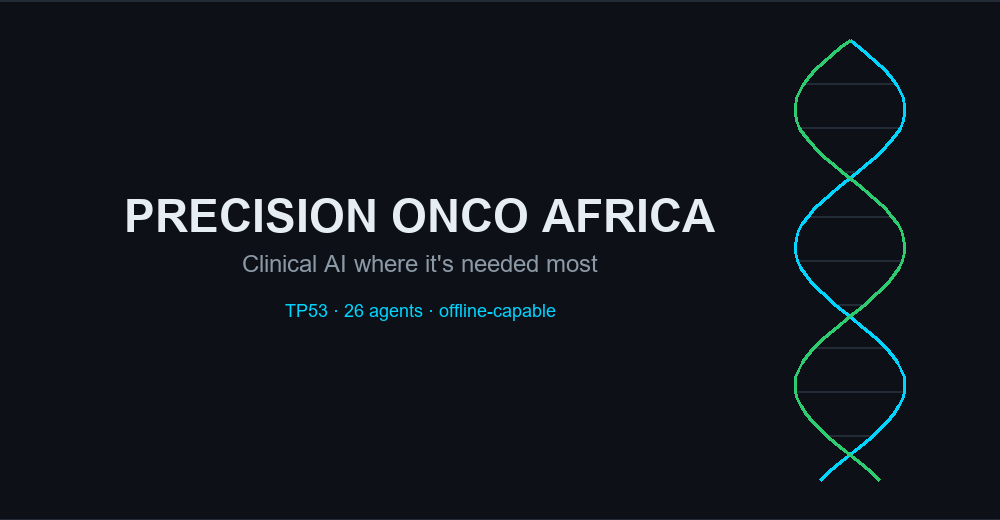

# 🧬 Precision Onco Africa — Multi-Omics AI for Precision Oncology

 — A local-first, privacy-preserving multi-agent AI platform for TP53 analysis

[](https://tp53analysis-g8iqzkuhoqmjcjtkvjcgbb.streamlit.app/)
[](https://ai.google.dev/gemma)
[](https://www.amd.com/en/products/accelerators/instinct.html)
[](tests/)
[](docker-compose.yml)
[](https://www.python.org)
[](LICENSE)
[](https://github.com/mbote-droid/precision-onco-africa)



> ## 🏁 Quick Start for Judges — AMD Hackathon ACT II · Track 3 **and** Best Use of Gemma
>
> **What it is:** an offline-capable, honesty-first oncology copilot where six AI
> specialists **debate a TP53 case, vote toward a consensus, and hunt for
> evidence that would _contradict_ it** — before it reaches a clinician.
>
> **Why it wins Track 3 (Unicorn):** a concrete user (Dr. Amara, a district
> clinician with no oncologist and no reliable internet), a real market, and
> genuine AMD use — **Gemma served on AMD Instinct via Fireworks/vLLM**, a ROCm
> benchmark harness, and an honest self-healing GPU-ops layer.
>
> **Why it wins Best Use of Gemma:** Gemma is the **multimodal core** — it *sees*
> pathology slides, *reads* photographed lab reports (no OCR), and *looks at* a
> rendered protein structure, then reasons over all of it. One open model for
> sight + language, offline or on AMD.
>
> **Run it in one command:**
> ```bash
> git clone https://github.com/mbote-droid/precision-onco-africa
> cd precision-onco-africa
> docker compose up --build
> # App → http://localhost:8501     API docs → http://localhost:8000/docs
> ```
> **See the wow in 60 seconds:** open the **⭐ Tumour Board** tab, enter `R175H`,
> click **Convene the board** — watch the debate → consensus → the "Why?"
> evidence trace.
>
> **AMD-specific submission details:** **[AMD_SUBMISSION.md](AMD_SUBMISSION.md)**
> (integration, benchmarks, product/market).
>
> **Live demo:** https://tp53analysis-g8iqzkuhoqmjcjtkvjcgbb.streamlit.app/ · **AMD inference mode:** set
> `INFERENCE_MODE=fireworks` in `.env`.
>
> ---
>
> ### ✨ Why this is a *creative* use of Gemma 4 and AMD
>
> **Gemma 4 as a multimodal reasoning core — not a chatbot:**
> - 👁️ **Gemma *sees* the protein.** We render the mutated p53 backbone and hand
>   Gemma the *image* — it looks at the structural warp and reasons about it, no
>   text hand-off. *(also reads H&E slides + photographed paper lab reports — no OCR.)*
> - 🧮 **Gemma *votes with math*.** Six specialist personas each return a
>   probability distribution over treatments; the board consensus is a graphed
>   vote, not a wall of prose.
> - 🔴 **Gemma *argues against itself*.** An adversarial skeptic actively hunts
>   for *contradicting* evidence — retracted papers, trials stopped early —
>   before any answer reaches the clinician.
> - 🌍 **Gemma *speaks the clinic's language*.** Kiswahili symptoms are mapped to
>   HPO/ICD-10 codes; and you can **hold a spoken, multi-turn conversation** with it
>   (faster-whisper in, browser TTS out, on-device barge-in, understands "that will
>   be all").
> - 🧬 **Gemma *designs*, AMD *folds*.** In the *In-Silico Structural Rescue*, Gemma
>   proposes a second-site suppressor for R175H, **ESMFold folds it for real on an
>   AMD Instinct MI300X**, and Gemma reads the measured geometry back — reasoning
>   about 3D space, fact-checked by GPU compute. (In-silico hypothesis, RUO.)
>
> **AMD, used intelligently — cloud to clinic on one codebase:**
> - ⚡ **Hardware-elastic.** One env var moves inference from an 8 GB *offline*
>   laptop to **Gemma served on AMD Instinct via Fireworks / vLLM** — **182 s →
>   5.1 s (~35×)**, measured.
> - 🔥 **Real MI300X compute.** ESMFold folds full-length p53 in **2.8 s** on a live
>   **AMD Instinct MI300X**; `rocm-smi` captured *under load* shows **GPU 100% at
>   749 W** — genuine telemetry in [`data/amd_mi300x_rocm_smi.txt`](data/amd_mi300x_rocm_smi.txt).
> - 🩺 **Autonomic GPU ops.** A self-healing manager watches *real* `rocm-smi` +
>   `psutil` telemetry and reclaims memory under load — honest by design (real
>   GPU numbers only on real AMD hardware, never faked).
> - 🔬 A ROCm/vLLM **benchmark harness** and an honest compute probe throughout.

Precision Onco Africa is less a chatbot than an **AI operating environment for precision oncology**: a multi-agent platform for interpreting TP53 mutations, built to work where it is needed most — clinics and labs with constrained hardware and unreliable connectivity. It runs on a commodity laptop (8 GB RAM, no GPU), keeps patient-adjacent data on the machine by default, and degrades gracefully to a fully offline mode.

The platform is opinionated about honesty. It never fabricates clinical numbers, it labels illustrative content as such, and every recommendation can be traced back to its evidence. That principle shaped the three features it leads with:

- **Live AI Tumour Board.** Six specialist agents — pathologist, geneticist, oncologist, surgeon, pharmacologist, and an equity officer — each form an evidence-grounded opinion on a case, cross-examine one another, and vote toward a consensus. Confidence is *earned*: a well-characterised hotspot yields high agreement; a variant of uncertain significance yields a cautious, low-confidence result that says so.
- **Explainability ("Why?").** Every assessment expands into a transparent trace: molecular classification, ClinVar, SIFT/PolyPhen, CADD, gnomAD rarity, ESM-2 effect, the perturbed p53 pathways, literature citations, and an explicit list of what is *not* known.
- **An African equity layer.** Regional cancer-genomics epidemiology, a bias/drift detector, locally-aware treatment alternatives, and Kiswahili patient reports — a copilot built for under-served populations, not a generic TP53 wrapper.

It also carries a real AMD story: a fourth inference mode served on AMD Instinct GPUs via Fireworks, a ROCm benchmark harness for the AMD Developer Cloud, and an honest current-vs-future deployment map. And because it is a genomics platform, its own source code is visualised as a DNA double helix.

> **Why it matters:** much of sub-Saharan Africa faces a severe shortage of oncologists and clinical geneticists. A transparent, offline-capable second opinion — one that is honest about its own uncertainty — is more useful here than a faster black box.

## 🏗️ Architecture

**26 AI Agents + 1 Orchestrator:**

```
USER INPUT (Text / Voice / VCF upload)
    ↓
DISPATCHER (parallel routing to agents)
    ├→ Agent 1:  Variant Curator (ClinVar/COSMIC/IARC classification)
    ├→ Agent 2:  Drug Discovery (ChEMBL real drug data + KEML targeting)
    ├→ Agent 3:  Immunogenicity (TME profiling, checkpoint response)
    ├→ Agent 4:  Gene Expression (Pathway analysis, RNA-seq)
    ├→ Agent 5:  Enzyme Design (PROTAC, molecular glues, zinc rescue)
    ├→ Agent 6:  Liquid Biopsy (ctDNA VAF trends, resistance)
    ├→ Agent 7:  Dossier Compiler (FHIR R4 + academic/pharma reports)
    ├→ Agent 8:  Surgical Brief (Clinical interpretation for oncology)
    ├→ Agent 9:  Auditor (Quality control, hallucination & bias checks)
    ├→ Agent 10: African Drift (Regional variant prevalence / equity)
    ├→ Agent 11: Multilingual (Swahili + cross-language support)
    ├→ Agent 12: PDF Report (Enterprise dossier generation)
    ├→ Agent 13: Structure Viz (3D protein visualization, Mol*/3Dmol)
    ├→ Agent 14: Clinical Interpretation (Prognosis & cancer associations)
    ├→ Agent 15: Pathology Vision (H&E slide tissue classification)
    ├→ Agent 16: TNM Staging (AJCC clinical staging)
    ├→ Agent 17: African TP53 Atlas (regional cancer-genomics epidemiology)
    ├→ Agent 18: ClinVar Conflict Checker (hallucination guard)
    ├→ Agent 19: Clinical Trials Matcher (Kenya/Africa-prioritised, live ClinicalTrials.gov)
    ├→ Agent 20: IND Generator (FDA Investigational New Drug draft sections)
    ├→ Agent 21: Synthetic-Lethality Modeler (WEE1/ATR/CHK1, DepMap-derived)
    ├→ Agent 22: Molecular Docking (AutoDock Vina if installed, else estimate)
    ├→ Agent 23: Structural Analyzer (ΔΔG, cavity druggability, contacts)
    ├→ Agent 24: Tumour Board (six specialists debate → vote → consensus)
    ├→ Agent 25: Explainability (transparent "why?" evidence trace)
    └→ Agent 26: Command Center (continental decision-support aggregation)
    ↓
+ utility services: ChEMBL drug data · PubMed citations · VCF parser
+ AMD layer: Fireworks (AMD Instinct) inference mode · ROCm benchmark harness
+ visuals: DNA-helix codebase graph · needle/lollipop mutation map
    ↓
GEMMA 4 (Inference — Ollama / llama.cpp local, or Google AI Studio API on cloud)
    ↓
CHROMADB RAG (TP53 knowledge base + BM25 hybrid + HNSW; local-ONNX embeddings on cloud)
    ↓
FHIR R4 + PDF + JSON REPORT  ·  ClinVar safety cross-check
```

### Architectural style — a hybrid (modular monolith + microservices layer)

The platform deliberately combines **both** patterns:

- **Modular-monolith core.** The Streamlit app runs as one process; the ~20
  agents are cleanly-separated Python modules (`agents/*.py`) with shared,
  in-process state. This keeps latency low and memory small — essential on
  the target 8GB-RAM / no-GPU hardware, where running each agent as its own
  service would multiply RAM and orchestration overhead for no benefit.
- **Microservices-style service layer.** On top, a FastAPI server
  (`api/server.py`), an n8n automation workflow, and a `docker-compose` of
  three independent services (Streamlit UI · FastAPI · n8n) expose the
  platform over the network for EHR/automation integration and independent
  scaling of the API surface.

**Why both?** A pure monolith couldn't integrate with external systems or
scale the API independently; pure microservices would be wasteful and slow on
constrained edge hardware. The hybrid gives the **efficiency and simplicity of
a monolith** for the compute-heavy agent pipeline, plus the **interoperability
and selective scalability of microservices** at the integration boundary — and
the clean module seams mean any heavy agent can later be peeled into its own
service if a workload ever demands it.

## 🚀 Core Features

✅ **Live AI Tumour Board**: six specialist agents debate a case and vote toward a consensus with earned confidence — deterministic and offline  
✅ **Explainability "Why?"**: every assessment expands into a traceable evidence dossier with an explicit uncertainty list  
✅ **AMD inference mode**: `INFERENCE_MODE=fireworks` runs hosted models on AMD Instinct GPUs; `tools/benchmark_amd.py` produces real ROCm numbers  
✅ **DNA-helix codebase graph**: the platform's own modules and imports rendered as a WebGL double helix  
✅ **Needle / lollipop map**: mutations positioned along the p53 protein over its domain track  
✅ **Offline Cancer Copilot**: an honest readiness map of what runs with no network (most of it)  
✅ **Agent evaluation harness**: deterministic per-agent latency, calibration, citation and uncertainty metrics  
✅ **Local Inference**: Gemma 4 via Ollama / llama.cpp (8GB RAM, no GPU, no API calls)  
✅ **Dual-Mode**: Offline (Ollama) or cloud (Google AI Studio) via `INFERENCE_MODE`  
✅ **Multimodal Input**: Type *or* speak — Whisper transcription wired into the query + structure tabs  
✅ **Hybrid Search**: BM25 keyword + semantic vector retrieval, cross-encoder reranking  
✅ **Semantic Cache**: Cosine-similarity cache (0.92 threshold) to avoid redundant LLM calls  
✅ **Self-Correction**: Automatic retry + fallback logic (3 attempts)  
✅ **PII Scrubbing**: SHA-256 hashing — HIPAA-compliant output filtering  
✅ **JSON Guardrails**: Strict output formatting + post-response validation  
✅ **Accuracy Benchmark**: Curator scored against ClinVar/IARC ground truth (offline, repeatable — `python -m benchmarks.run_benchmark`)  
✅ **ClinVar Hallucination Guard**: every AI answer is cross-checked against ClinVar; conflicting classifications are flagged (Query + Analysis tabs)  
✅ **Real Drug Data (ChEMBL)**: live ChEMBL API for TP53-pathway compounds + clinical phase, with an offline curated fallback  
✅ **Clinical Trials Matcher**: live ClinicalTrials.gov v2 search, **Kenya/African sites prioritised**  
✅ **VCF Input**: upload a patient VCF → auto-extract TP53 variants (chr17p13.1, GRCh38 + hg19) from the file's HGVS annotation  
✅ **African TP53 Atlas**: regional cancer-genomics epidemiology (aflatoxin/R249S HCC, ESCC corridor, …) with an Africa choropleth  
✅ **Synthetic-Lethality Modeler**: ranked SL targets (WEE1/ATR/CHK1…) from curated DepMap signals + radial network  
✅ **Molecular Docking**: AutoDock Vina when installed, else a clearly-labelled binding-affinity estimate  
✅ **Structural Mechanics & Cavity Analysis**: ΔΔG destabilisation, pocket druggability, residue contacts (radar)  
✅ **IND Draft Generator**: FDA Investigational New Drug skeleton (downloadable) from a mutation + lead candidate  
✅ **PubMed Citations**: live Entrez literature with inline `[PMID]` references  
✅ **Animated Clinical UI**: dark bioinformatics theme, animated VAF/hotspot charts, live agent-status board, animated dispatch network, auto-rotating domain-coloured 3D structure, drug-docking pose  
✅ **FHIR R4 Export**: HL7 clinical interoperability  
✅ **n8n Workflows**: visual node-based automation with EHR alerting (wiring CI-verified — `tools/validate_n8n.py`)  

### ✨ New: multimodal core, honest-uncertainty & the adversarial evidence layer

🧬 **Gemma-as-multimodal-core**: Gemma 4 vision reads a **pathology slide** *or* a **photographed paper lab report** directly — no separate CNN, no OCR engine — and cross-checks any mutation it reads against ClinVar (Pathology tab, one-click synthetic demo).  
🧫 **Sanger `.ab1` chromatogram → variant calling**: real Biopython trace parse + QC + **heterozygous double-peak detection** + reference variant calls with per-base quality gating (Analysis tab; ships a synthetic sample trace).  
🧩 **Multimodal case fusion**: unify variant + slide + lab-report + Sanger + notes into one Gemma-written case summary — only the modalities you actually provided (Report tab).  
🔴 **Adversarial Evidence Layer**: a bounded 2-turn skeptic↔proposer debate that *actively retrieves contradicting evidence* (ClinVar conflicts, trials **stopped early**), plus a **counterfactual trial Viability gauge** and a retraction/trust rerank prior. Never runs to convergence (laptop-safe).  
🎯 **Honest epistemic uncertainty**: samples the model N× and reports a green/amber/red **Epistemic Uncertainty Index** from answer agreement — the legitimate version of MC-dropout for a hosted model (Query tab).  
🎭 **Orthogonal personas**: each specialist/role samples at a distinct temperature so multi-agent disagreement is real, not an echo chamber.  
🌍 **Kiswahili → HPO/ICD-10** mapping with a confidence gate (equity layer maps meaning, not just words).  
⚡ **Semantic cache warming**: pre-computes related TP53 hotspots so likely follow-ups are instant.  
🕸️ **GraphRAG-lite**: TP53 pathway relationship triples folded into retrieval, so one vector lookup returns both prose and structure.  
🖥️ **Hardware-elastic inference**: same codebase runs serialised/offline on an 8 GB laptop ↔ parallel-batched on AMD Instinct via `INFERENCE_MODE` — **182 s → 5.1 s (~35×)**.  
🎤 **Jarvis voice loop**: speak a question → Whisper transcribes → Gemma answers → the browser reads it back.  

> Math behind the new signals (Epistemic Uncertainty Index, Viability, trust rerank, Kiswahili→HPO gate) is documented in **[METHODS.md](METHODS.md)** §9–§12.

> ⚠️ **Research & educational use only — not for clinical decisions.** Some visuals (e.g. docking affinities) are illustrative, not measured; live data (ClinVar/ChEMBL/ClinicalTrials.gov) should be verified at source.

## 📊 Use Cases

| User | Workflow |
|------|----------|
| **Oncologist** | Upload patient TP53 variant → Get clinical interpretation + drug recommendations |
| **Researcher** | Record voice query → Instant literature-grounded answer + sources |
| **Pharma R&D** | Batch analyze mutations → Identify synthetic lethal targets → Generate IND dossiers |
| **Academic Lab** | Local deployment → No cloud costs, full data privacy |

## 📱 Responsive design (honest scope)

The 13 feature tabs are grouped into **6 top-level sections** (Analyze, Tumour
Board, Molecular, Reports & Staging, Global & Trials, Voice & Tools), each
holding an inner tab row for its members — this replaced a flat 13-tab bar
that overflowed on anything narrower than a wide desktop window. A dedicated
`@media (max-width: 768px)` pass tightens padding, heading sizes, tab-label
size, and metric-value size for phone/narrow-window use, and any tab row that
still doesn't fit scrolls horizontally rather than clipping. This is a
**usable, tested layout down to a 375px mobile viewport** — not a
mobile-native redesign; dense views (the multi-agent architecture diagram, 3D
structure viewers, Plotly tables) are still most legible on a laptop screen or
larger.

## 🔒 Security

Every untrusted boundary — file uploads, free text reaching the model, and
values rendered into interactive components — is hardened and adversarially
tested. Uploads are validated for size, type and content (executables, zip
bombs, oversized files and non-VCF data are blocked with friendly messages);
prompt-injection patterns are detected and neutralised; outputs are HTML-escaped
and all database access is parameterised; PII is scrubbed before logging.

**For the full threat model, the specific attacks simulated, and how each is
handled, see [SECURITY.md](SECURITY.md).**

## 📐 Methods

The quantitative methods are documented with their formulas (ESM-2 effect
scoring, hybrid retrieval, semantic caching, consensus confidence, ΔΔG, pLDDT,
routing and QC savings) — see [METHODS.md](METHODS.md). The system design and
the heterogeneous AMD compute roadmap are in [ARCHITECTURE.md](ARCHITECTURE.md). A per-module
reference (purpose + public API of all 80 modules) is auto-generated in
[CODE_MAP.md](CODE_MAP.md). For the AMD hackathon see
[AMD_SUBMISSION.md](AMD_SUBMISSION.md) (integration, benchmarks, product/market).

## 🗺️ Future Build Considerations

Deliberately scoped *out* of the current build, documented here as a credible
roadmap rather than overclaimed as done:

- **Real on-chip computer vision** for the microfluidic QC step (currently a
  decision policy on simulated telemetry).
- **Physical edge hardware** — Ryzen AI NPU, AMD Kria FPGA, hospital edge
  servers (currently a clean mock device API + an honest deployment map).
- **Federated learning** across institutions without sharing patient data.
- **Whole-genome expansion** beyond TP53 (BRCA1/2, KRAS, EGFR, …) on the
  existing gene-agnostic seams.
- **A distilled TP53-specialist model** for faster offline inference (requires
  GPU training and rigorous evaluation first).

## 🛠️ Quick Start (5 minutes)

### Prerequisites
- Python 3.10+
- 8GB+ RAM
- NCBI Email (for sequence fetching)

### Installation

```bash
git clone https://github.com/mbote-droid/tp53_analysis.git
cd tp53_analysis

# Create virtual environment
python3 -m venv venv
source venv/bin/activate  # Windows: venv\Scripts\activate

# Install dependencies
pip install -r requirements.txt

# Copy environment config
cp .env.example .env
# Edit .env → set ENTREZ_EMAIL & LLAMA_CPP_HOST
```

### Launch Web Interface

```bash
# Terminal 1: Start llama.cpp inference server
wget https://huggingface.co/Google/gemma-4-e4b-GGUF/resolve/main/gemma-4-e4b-Q4_K_M.gguf
./llama-server -m gemma-4-e4b-Q4_K_M.gguf -c 8192 --timeout 300 --threads 4 --parallel 2

# Terminal 2: Build knowledge base (first time only)
cd tp53_rag
python main.py build

# Terminal 3: Launch web app
streamlit run tp53_rag/app.py
```

Visit: `http://localhost:8501` (or `8502` locally)

**Web app tabs (12):**
- 🔍 Query — Text-based RAG questions, with the ClinVar safety check on every answer
- 🧬 Analysis — Multi-agent dispatcher + live status board + Molecular Profile visuals + **VCF upload**
- 💊 Drug Discovery — **ChEMBL** real drug/clinical-phase data + illustrative docking pose
- 📊 Visualization — Animated VAF timeline, hotspot chart, dispatch network
- 📋 Report — FHIR-aware clinical report generator
- 🔬 Structure — Auto-rotating, domain-coloured 3D protein + multimodal (voice) narration
- 🎤 Voice — Whisper transcription + auto-analysis
- 🛠 Debug — System status & cache stats
- 🔬 Pathology — H&E slide tissue classification
- 📍 TNM Staging — AJCC clinical staging + stage-progression gauge
- 🌍 African Atlas — Regional TP53 epidemiology + Africa choropleth
- 🧪 Clinical Trials — Live ClinicalTrials.gov search, Kenya/Africa-prioritised

### Docker (One-Command Deployment)

```bash
cd tp53_rag
cp .env.example .env          # then add your GOOGLE_API_KEY etc.
docker compose up --build     # first run builds the image
```

Access:
- **Web**: http://localhost:8501
- **API**: http://localhost:8000/docs
- **n8n**: http://localhost:5678

## 📚 Usage

### CLI Commands

```bash
# Interactive Q&A with RAG
python tp53_rag/main.py query

# Run full multi-agent demo
python tp53_rag/main.py demo

# Test individual agent
python tp53_rag/main.py test-rag
python tp53_rag/main.py test-variant

# REST API server
python tp53_rag/main.py serve

# 3D structure visualization
python tp53_rag/main.py visualise --accession NM_000546

# List all agents
python tp53_rag/main.py list-agents
```

### Python API

```python
# Variant classification (rule-based, no LLM required)
from agents.variant_curator import VariantCurator
curator = VariantCurator()
result = curator.classify("R175H")
c = result["classification"]
print(c["clinical_significance"], c["iarc_classification"])  # -> pathogenic R1

# Drug discovery
from tp53_rag.agents.dispatcher import AgentDispatcher
from tp53_rag.knowledge_base.vector_store import TP53VectorStore
dispatcher = AgentDispatcher(vector_store=TP53VectorStore())
result = dispatcher.dispatch_single(
    agent_type="drug_discovery",
    custom_question="What drugs target R175H?"
)
print(result.answer)

# Immunogenicity prediction
from tp53_rag.agents.immunogenicity import ImmunogenicityPredictor
predictor = ImmunogenicityPredictor()
tme = predictor.predict("R248W")
print(tme['tme_status'], tme['checkpoint_recommendation'])
```

### Classic Bioinformatics Pipeline (Still Available)

```bash
# Full analysis with all steps
streamlit run app.py

# Or CLI
python main_tp53_analysis.py --accession NM_000546 --skip-phylo --skip-domains
```

## 🎯 Benchmarking

The Variant Curator is benchmarked against curated **ClinVar / IARC** ground truth so accuracy is measured, not assumed. The harness is offline (rule-based curator, no LLM needed) and fully opt-in — it never touches the live app.

```bash
python -m benchmarks.run_benchmark           # writes a timestamped markdown + JSON report
python -m benchmarks.run_benchmark --no-save # print only
```

Ground truth lives in [`benchmarks/ground_truth.json`](benchmarks/ground_truth.json) (7 pathogenic hotspots incl. R249S — the aflatoxin/sub-Saharan HCC hotspot — plus benign and VUS controls). Reported metrics: exact accuracy, bucketed concordance, IARC concordance, and precision/recall/F1 for pathogenic detection.

> Benchmarking immediately paid off: it caught a hotspot-key bug that was mislabelling every pathogenic hotspot as **VUS**. After the fix, exact accuracy rose **11% → 89%** and pathogenic-detection recall **0% → 100%**. The fix is locked by regression tests.

## 🧪 Testing

```bash
pytest tests/ -v                       # full suite
pytest tests/test_rag_platform.py -q   # unit + agent tests (no live LLM; mocked)
```

Tests run without a live model. Coverage includes the RAG chain, dispatcher, every agent, the visualization helpers (`utils/viz.py`), the benchmark scoring/runner, and a regression lock on the variant-classification fix.

## 📦 Project Structure

```
tp53_analysis/
└── tp53_rag/                      # Main RAG platform
    ├── app.py                     # 🎤 Streamlit web app (10 tabs, animated UI)
    ├── main.py                    # CLI orchestrator & agent router
    ├── agents/                    # 23 specialized agents
    │   ├── rag_chain.py           # LLM inference (Ollama/llama.cpp/API + ChromaDB)
    │   ├── dispatcher.py          # Parallel multi-agent orchestration
    │   ├── variant_curator.py     # ClinVar/COSMIC/IARC classification
    │   ├── immunogenicity.py      # TME profiling
    │   ├── dossier_compiler.py    # FHIR R4 + PDF reports
    │   ├── african_drift.py       # Regional/equity variant analysis
    │   ├── pathology_vision.py    # H&E slide classification
    │   ├── tnm_staging.py         # AJCC staging
    │   └── ...
    ├── knowledge_base/
    │   ├── ingestion.py           # Document processing
    │   └── vector_store.py        # ChromaDB + BM25 + HNSW
    ├── utils/
    │   ├── viz.py                 # 📊 Charts, dispatch network, 3D viewer (pure, tested)
    │   ├── voice_transcriber.py   # 🎤 Whisper integration
    │   ├── rag_cache.py           # Semantic caching
    │   ├── pii_scrubber.py        # HIPAA SHA-256 scrubbing
    │   └── hybrid_search.py       # BM25 + vector fusion
    ├── benchmarks/                # 🎯 Accuracy benchmark (ClinVar/IARC)
    │   ├── ground_truth.json
    │   ├── scoring.py
    │   └── run_benchmark.py
    ├── api/server.py              # FastAPI server (n8n integration)
    ├── tests/test_rag_platform.py # Unit + agent + benchmark tests
    ├── n8n_workflow.json          # Automation workflow (EHR alerting)
    ├── requirements.txt           # Dependencies
    ├── .env.example               # Environment template
    └── README.md                  # This file
```

## 🎯 Platform Pitch

**Problem**: TP53 is mutated in 50% of human cancers but notoriously hard to drug.

**Solution**: A local-first, multi-agent AI platform that:
1. **Classifies variants** instantly (ClinVar/COSMIC)
2. **Maps structural defects** for drug design (AlphaFold)
3. **Finds synthetic lethal targets** (DepMap)
4. **Screens drug candidates** (ChEMBL)
5. **Predicts immune response** (TME profiling)
6. **Generates enterprise dossiers** (FHIR R4 + PDF)

**Why this matters**:
- ✅ **Privacy-first**: Runs locally — no data leaks to cloud
- ✅ **Efficient**: Gemma 4 4B on 8GB RAM (edge-deployable)
- ✅ **Africa-relevant**: Regional variant data + KEML drug context — a genuine differentiator
- ✅ **Open-source**: MIT license, fully reproducible

## 📚 Key Publications Integrated

- **IARC TP53 Database**: Clinical significance of mutations
- **COSMIC**: Somatic mutation burden across cancers
- **ClinVar**: Variant pathogenicity classifications
- **DepMap**: Synthetic lethality networks
- **AlphaFold**: Protein structure predictions
- **STRING**: Protein-protein interactions

## 🏥 Clinical Integration

### FHIR R4 Compliance
All outputs are HL7 FHIR R4 compatible for EHR integration:
```json
{
  "resourceType": "ClinicalImpression",
  "status": "completed",
  "code": {"coding": [{"system": "http://snomed.info/sct", "code": "..."}]}
}
```

### HIPAA Compliance
- ✅ PII scrubbing (automatic)
- ✅ Audit logging (HIPAA_AUDIT_LOG)
- ✅ Local inference (no data leaks)
- ✅ Encryption-ready (AWS HealthOmics compatible)

## ⚡ Performance

| Metric | Value |
|--------|-------|
| LLM Latency | 2-5s (Gemma 4 4B, CPU) |
| RAG Retrieval | <500ms (ChromaDB HNSW) |
| Variant Classification | <1s |
| Full Demo | ~30s (6 agents) |
| Memory | 2.8GB (Q4_K_M quant) |

## 🐳 Docker Deployment

```bash
cd tp53_rag
cp .env.example .env              # add your secrets first
docker compose up --build         # Web=:8501, API=:8000, n8n=:5678
```

For a Raspberry Pi / ARM64 host, the same image cross-builds with:

```bash
docker buildx build --platform linux/arm64 -t tp53-rag:arm64 .
```

The pathology vision agent (torch/timm) is excluded from the default
lean image to fit low-RAM hosts; use `Dockerfile.full` on a machine
with spare RAM to enable it:

```bash
docker build -f Dockerfile.full -t tp53-rag:full .
```

## 🧭 Recommendations / Future Enhancements

Running notes so nothing is forgotten. Tackle as time/hardware allow.

### Performance — unlock on a higher-RAM machine
The platform is tuned for 8 GB RAM / no GPU. On a bigger machine you can dial
quality/throughput back up:
- **Longer answers:** raise `CTX_RESPONSE` (env var; default `1024`, trimmed
  from 4000 for latency). Set e.g. `CTX_RESPONSE=2048+` for fuller reports.
- **ESM-2 effect labelling:** the deleterious/uncertain/tolerated cut-offs are
  env-configurable (no code edit) — `ESM2_THRESH_DELETERIOUS` (-7.5),
  `ESM2_THRESH_POSSIBLY` (-4.0), `ESM2_THRESH_UNCERTAIN` (0.0). Tune after
  calibrating against labelled data.
- **Parallel dispatch (API mode):** "Full Analysis" runs ~6 agents
  sequentially. In `INFERENCE_MODE=api` (no local-RAM cost) these can be run
  concurrently to cut full-dispatch latency toward single-call time.
- **Higher concurrency:** raise the inference semaphore cap (app.py) once RAM
  allows more simultaneous LLM calls.
- **Pathology vision:** build `Dockerfile.full` (adds torch/timm) to enable the
  H&E tissue-classification agent.
- **Larger local model:** swap the Gemma 2B Q4_K_M for a larger quant once you
  have the RAM/VRAM headroom.

### Demo vs real
- Real, grounded RAG is the **default**. Set `DEMO_MODE=1` **only** for fast
  offline video demos — it returns clearly-labelled `[DEMO DATA]` canned
  answers instead of live inference. Never ship/showcase with `DEMO_MODE` on.

### Pre-marketplace hardening
- ✅ App-wide **Research-Use-Only** banner in the UI + top-level
  [`DISCLAIMER.md`](DISCLAIMER.md).
- ✅ **Tone cleanup** for clinical credibility (demo/marketing language removed).
- ✅ **Honest dispatch** — real RAG by default; canned answers only under an
  explicit, clearly-labelled `DEMO_MODE`.
- ✅ **Mobile/responsive** CSS pass (scrollable tabs, fluid charts, breakpoints).
- ⬜ RUO disclaimers embedded in all exports (FHIR/PDF/JSON).
- ⬜ **Repo split** — separate `tp53_rag` into its own standalone repository
  (deferred until the project is otherwise complete).

### New since v1 (this hardening pass)
- **Interactive 3D multi-agent graph** (WebGL force-directed, Obsidian-style) in
  the Visualization tab, with an offline-safe 2D fallback.
- **Persistent conversation memory** — past turns are stored locally and
  **PII-scrubbed**, so conversations resume across restarts instead of starting
  from zero. Isolated per session by default; set `MEMORY_SESSION_ID` for
  persistent single-user memory. Clear it anytime in Debug & Admin.
- **Real variant annotation** (Analysis tab) — molecular consequence + SIFT /
  PolyPhen from **Ensembl VEP**, plus **ClinVar** significance, **gnomAD** allele
  frequency and **CADD** from **MyVariant.info**. Offline-first: a curated
  hotspot baseline always works; live APIs supply exact current values on
  demand. (Local VEP/SnpEff are intentionally avoided — their multi-GB caches
  don't fit the 8 GB / offline-first target; the REST route gives the same real
  data.)
- **ESM-2 variant-effect prediction** — real protein-language-model scoring
  (masked-marginal log-likelihood) for TP53 missense variants. The heavy compute
  runs **once** on a torch/GPU host via `tools/precompute_esm2.py` (fetches the
  canonical sequence from UniProt, scores every substitution), producing a small
  JSON matrix the app then serves **offline with no torch at runtime**. Until the
  matrix is generated the app honestly reports "not computed" — no fabricated
  scores. Shown as a gauge in the Analysis tab.
- **AlphaFold real structure** (Structure tab) — fetches the genuine
  AlphaFold-predicted p53 structure (UniProt P04637) from the AlphaFold DB and
  renders it in 3D **coloured by per-residue pLDDT confidence** (very high →
  very low), with a confidence profile and hotspot-residue pLDDT. Version-proof
  (resolves the current model via the AlphaFold API); offline-first (falls back
  to the experimental-structure viewer if unreachable). Fetched server-side, so
  no browser CORS issues.

### Evidence & docs
- **Benchmark the RAG answers**, not just the rule-based variant curator (today
  only the curator has measured accuracy).
- **Build-journey / decision-log document** — capture *why* each design choice
  was made (RAG vs fine-tune, modular monolith vs microservices, local vs cloud
  inference, etc.) for reuse in future projects.

### Scalability (Steps 4–5)
- Load/stress testing, horizontal scaling of the API surface, database and
  fault-injection experiments, monitoring/observability.

## 📝 License

MIT License — See [LICENSE](LICENSE)

## 👨‍💻 Author

**Dr Samuel Ngigi Mbote**  
General Surgery Resident (COSECSA) · IBM Certified AI Developer · Nairobi, Kenya  
Daktari Genomed Labs  

## 🙏 Acknowledgments

- **Google Gemma Team** — Gemma 4 model
- **Meta LLaMA** — llama.cpp framework
- **Chroma** — Vector database
- **n8n** — Workflow automation

---

**Built by Daktari Genomed Labs · Nairobi, Kenya** 🧬
