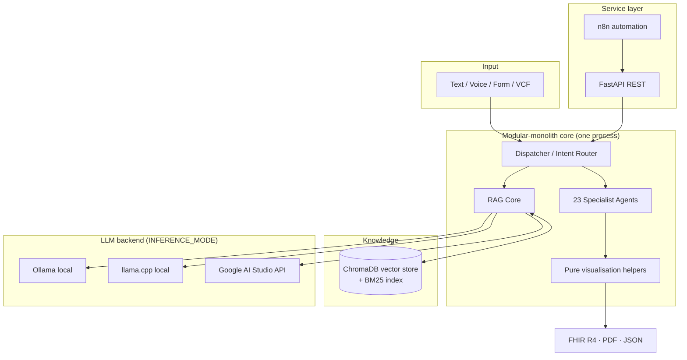

# TP53 RAG Platform — Technical Whitepaper

**A local-first, privacy-preserving multi-agent AI system for TP53 cancer-genomics analysis on commodity hardware**

Daktari Genomed Labs · Author: Dr Samuel N. Mbote
Version 1.0 · 2026-06-04

---

> ### ⚠️ Intended Use — Research Use Only (RUO)
> This platform is a **research and decision-support tool for qualified
> researchers and clinicians**. It is **not a diagnostic device**, is **not
> FDA-cleared / CE-marked**, and must **not** be used as the sole basis for any
> diagnosis or treatment decision. All variant classifications, drug-discovery
> outputs, docking affinities, and structural estimates are **informational**.
> Clinically actionable findings must be independently confirmed by a
> CLIA-certified / accredited laboratory and a qualified clinician. See
> [§10 Limitations & Intended Use](#10-limitations--intended-use).

---

## Table of Contents

1. [Executive Summary](#1-executive-summary)
2. [Problem & Motivation](#2-problem--motivation)
3. [Design Goals & Constraints](#3-design-goals--constraints)
4. [System Architecture](#4-system-architecture)
5. [The Retrieval-Augmented Generation Core](#5-the-retrieval-augmented-generation-core)
6. [Safety, Privacy & Trust](#6-safety-privacy--trust)
7. [The Multi-Agent Layer](#7-the-multi-agent-layer)
8. [Equity Layer: African Cancer-Genomics Context](#8-equity-layer-african-cancer-genomics-context)
9. [Evaluation & Benchmarks](#9-evaluation--benchmarks)
10. [Limitations & Intended Use](#10-limitations--intended-use)
11. [Deployment & Packaging](#11-deployment--packaging)
12. [Reproducibility & Engineering Quality](#12-reproducibility--engineering-quality)
13. [Roadmap](#13-roadmap)
14. [Data Sources & References](#14-data-sources--references)
15. [Appendix: Configuration Defaults](#15-appendix-configuration-defaults)

---

## 1. Executive Summary

The *TP53 RAG Platform* is a multi-agent artificial-intelligence system that
analyses mutations in **TP53** — the single most frequently mutated gene in
human cancer (somatic mutations in >50% of all tumours). It turns a typed
question, a voice note, a mutation-and-cancer form, or an uploaded **VCF** file
into a grounded, source-cited, clinically-contextualised answer, plus a set of
structured analyses (variant classification, drug options, structural
mechanics, clinical-trial matches, regulatory drafts, and more).

Its defining engineering choice is that **it runs entirely on commodity
hardware — 8 GB of RAM, no GPU — and is offline-first.** Patient identifiers
never need to leave the machine; the language model, the embeddings, and the
vector database can all run locally. This makes it suitable for
privacy-sensitive clinical and pharmaceutical settings and for low-resource
deployment environments, including a Raspberry Pi-class edge device.

Three properties distinguish it from a generic "chat-over-documents" RAG:

1. **A safety-first retrieval pipeline** — hybrid (semantic + keyword)
   retrieval, cross-encoder reranking, a self-correction loop, a hallucinated-
   mutation detector, and a **ClinVar concordance guard** that cross-checks the
   model's own claims against a curated reference.
2. **A 23-agent analytical layer** — most agents are *deterministic and
   rule-based* (no LLM, fully offline), so their outputs are reproducible and
   fast; live-data agents call external biomedical APIs **offline-first** with
   curated fallbacks.
3. **An African cancer-genomics equity layer** — regional variant prevalence,
   a bias/drift detector, Kenya/KEML drug-availability context, and Swahili
   output — addressing populations under-represented in genomic medicine.

The codebase is engineered to production standards: a **hybrid
modular-monolith + service architecture**, **199 automated tests**,
graceful degradation on every external dependency, and reproducible Docker
packaging (multi-architecture, ARM64/Raspberry-Pi-ready).

---

## 2. Problem & Motivation

**The clinical problem.** TP53 (the p53 "guardian of the genome") loses function
in the majority of human cancers. Its mutation status carries prognostic and
therapeutic weight, but interpreting a given variant is hard: the same gene
produces *conformational* mutants (e.g. R175H, R282W) and *contact* mutants
(e.g. R248W, R273H) with different biology, different drug responses (e.g.
APR-246 eligibility for a specific subset), and different structural
consequences. The relevant knowledge is scattered across IARC, ClinVar, COSMIC,
UniProt, ChEMBL, ClinicalTrials.gov, and the primary literature.

**The access problem.** General-purpose medical LLM tools are (a) cloud-hosted
— a non-starter where patient data cannot leave the institution, (b)
GPU-hungry, and (c) trained and benchmarked predominantly on data from
high-income, non-African populations. African cancer genomics — with distinct
exposures such as aflatoxin-B1-driven R249S in hepatocellular carcinoma, and
distinct drug-availability realities (national essential-medicines lists) — is
systematically under-served.

**The trust problem.** LLMs hallucinate. In a clinical-adjacent setting, a
confidently-stated but fabricated variant classification is worse than no
answer. Any serious system must *constrain*, *ground*, *verify*, and *label*
its outputs.

The TP53 RAG Platform is built to address all three: **run locally, serve the
under-served, and never trust the model blindly.**

---

## 3. Design Goals & Constraints

| Goal | Consequence in the design |
|---|---|
| **Run on 8 GB RAM, no GPU** | Small quantized local model (Gemma, Q4_K_M) via llama.cpp/Ollama; 384-dim ONNX embeddings; `TOP_K=3`, capped concurrency, token-budget manager. |
| **Offline-first** | Local LLM + local embeddings + local vector DB; every external API has a curated fallback; the app never hard-fails on a missing service. |
| **Privacy by design** | PII scrubbed (SHA-256) before any LLM call or log write; raw patient IDs never sent to the model; append-only audit trail; all processing can be on-device. |
| **Never trust the model blindly** | Constrained system prompts, grounding context, self-correction, hallucinated-mutation detection, ClinVar concordance guard. |
| **Never return empty** | Three-tier zero-result handling and curated fallbacks; visualisation helpers return a non-empty figure even on bad input. |
| **Reproducibility** | Deterministic rule-based agents; pinned dependencies; 199 automated tests; honest labelling of illustrative vs real data. |
| **Portability** | Multi-arch Docker image (amd64 + arm64); same code runs on a laptop, a cloud VM, or a Raspberry-Pi-class device. |

These constraints are **load-bearing** — they explain nearly every architectural
decision that follows.

---

## 4. System Architecture

The platform is a deliberate **hybrid of two patterns**:

- **A modular-monolith core.** A single Streamlit process hosts ~23 agents as
  cleanly-separated Python modules with shared in-process state. On 8 GB/no-GPU
  hardware, running each agent as its own microservice would multiply RAM and
  orchestration overhead for no benefit — so the compute-heavy pipeline stays
  in-process, keeping latency and memory low.
- **A thin microservices-style service layer.** On top, a **FastAPI** server
  exposes the platform as REST endpoints, an **n8n** workflow engine provides
  automation/EHR integration, and a **docker-compose** stack runs the three
  services (UI · API · automation) independently.

This gives the *efficiency of a monolith* for the agent pipeline plus the
*interoperability and independent scaling* of services for integration.



A companion document, `HOW_IT_WORKS.md`, describes the **runtime execution
cascade** stage-by-stage (cold boot → input → RAG core → safety → agents →
visualisation → output).

---

## 5. The Retrieval-Augmented Generation Core

The RAG core (`agents/rag_chain.py`) is an orchestrator that delegates to
isolated specialist components — *if any one fails, the others keep running*.
The full pipeline for an LLM-backed query:

```
query → PII scrub → semantic cache → hybrid search → rerank
      → context-window fit → LLM generate → self-correct (≤3×)
      → PII scrub (output) → cache store → audit log
```

### 5.1 Knowledge base & ingestion

The knowledge base is built from **curated, source-tagged TP53 knowledge**
(gene overview, domain architecture, hotspot mutations with HGVS/cDNA notation,
clinical management) plus optional live enrichment (NCBI gene summary, UniProt).
Documents are split with a recursive character splitter
(`CHUNK_SIZE=512`, `CHUNK_OVERLAP=64`) and every chunk carries metadata
(`source`, `category`, `gene`, `priority`). The store **auto-builds on first
run** — no manual build step — and persists to disk so subsequent starts load
instantly.

### 5.2 Embeddings (local, 384-dim)

Embeddings are environment-selected:

- **Local Ollama** (`nomic-embed-text`) when running in `ollama`/`llamacpp` mode.
- **Local ONNX `all-MiniLM-L6-v2`** (384-dim) otherwise — ChromaDB's built-in
  model, fetched once from a CDN and then run on-device via `onnxruntime`. This
  is the cloud-safe default: **no API key, no live embedding endpoint at query
  time**, and no dependency on the now-decommissioned HuggingFace Inference API.

### 5.3 Hybrid retrieval — semantic + keyword

Pure vector similarity is weak on **exact biomedical tokens** (`R175H`,
`APR-246`, `MDM2`). The platform therefore fuses two retrievers:

- **Vector search** via ChromaDB (HNSW index, cosine space) with a relevance
  threshold.
- **BM25** — a dependency-free implementation (`k1=1.5`, `b=0.75`) whose
  tokenizer deliberately preserves hyphenated/alphanumeric biomedical terms.

Scores are min-max normalised and combined with fixed weights:

> **fused = 0.7 · vector + 0.3 · BM25**

This recovers exact mutation/drug identifiers that a purely semantic search
would blur, while keeping semantic recall for natural-language questions.

### 5.4 Cross-encoder reranking

The fused top-**20** candidates are reranked by a cross-encoder
(`ms-marco-MiniLM-L-6-v2`, **lazy-loaded** on first use, no GPU) down to the
top-**5**, with a **diversity filter** that prevents the context from being
dominated by a single source. If the cross-encoder is unavailable, the system
falls back to normalised score fusion — it degrades, it does not break.

### 5.5 Context-window management

A token-budget manager keeps the prompt inside an **8192-token** context
(`system 1000 / retrieved 2000 / history 1000 / response 4000`, ~4 chars/token
heuristic). It truncates oldest conversation history first and always preserves
the mutation/patient context, so the small local model never overflows.

### 5.6 Inference backends (configurable)

A single `INFERENCE_MODE` environment variable selects the backend; each is
health-checked, with automatic fallback:

| Mode | Backend | Typical model | Where it shines |
|---|---|---|---|
| `ollama` | Ollama server | local Gemma | Local dev / on-prem |
| `llamacpp` | llama.cpp OpenAI-compatible server | Gemma 2B **Q4_K_M** | Edge / lowest-RAM (CPU) |
| `api` | Google AI Studio | Gemma (larger) | Cloud / no local weights |

Generation runs at **low temperature** (0.0–0.1) with a repeat penalty to
suppress degenerate output — the system is tuned for *deterministic, factual*
answers, not creative ones.

### 5.7 Self-correction loop

Every response is validated (see §6.3). On failure, the query is **retried up
to 3 times with a progressively tightened prompt** — each retry adds a stricter
constraint ("respond in 2–4 sentences using only confirmed hotspot mutations",
then "exactly 1 sentence, no speculation"). This converts a vague or
hallucinating first draft into a constrained, grounded answer.

### 5.8 Semantic cache

Responses are cached by **query-embedding similarity**: a new query whose
embedding is **≥ 0.92 cosine-similar** to a previous one returns the cached
answer immediately, with **no LLM call**. The cache is persisted in SQLite with
a 30-minute TTL and reports hit/miss statistics — a meaningful latency and
cost saver under repeated/near-duplicate questions.

### 5.9 Zero-result handling

Retrieval that returns nothing triggers a three-tier fallback: (1) **broaden**
the query and re-search, (2) on still-empty, return a **curated, agent-specific
fallback** grounded in established literature (with explicit external-resource
pointers), so the system **never returns an empty answer**.

---

## 6. Safety, Privacy & Trust

This section is the heart of the platform's clinical credibility. The system
treats the LLM as a *capable but untrusted* component and wraps it in layered
safeguards.

### 6.1 PII scrubbing (privacy by design)

A regex + SHA-256 **PII scrubber** runs on **both the input and the output**,
before anything reaches the LLM or a log file. It redacts patient IDs (incl.
Kenyan/NHS formats), SSNs, emails, phone numbers (incl. `+254` Kenyan),
dates-of-birth, and `Patient #…` patterns, replacing each with a non-reversible
`[REDACTED:TYPE:hash8]` token. Raw patient IDs are **never** included in the
prompt. IDs can be deterministically hashed for traceable-but-anonymous linkage.

> **Compliance framing (honest):** these are **HIPAA-aligned, privacy-by-design
> safeguards** (de-identification, local processing, audit logging). The
> platform is **not** independently certified or accredited for HIPAA/GDPR
> compliance; institutions remain responsible for their own compliance review.

### 6.2 ClinVar hallucination guard

A dedicated agent extracts the **mutations and the classification the AI
claimed** from a generated answer and **cross-checks them against a curated
ClinVar reference**, flagging conflicts inline (e.g. the model says "benign"
where ClinVar says "pathogenic"). This is a domain-specific factuality check
that a generic RAG lacks, and it is surfaced directly in the UI.

### 6.3 Response validation & hallucinated-mutation detection

A `ResponseValidator` rejects empty/too-short outputs and scans for
**hallucinated mutations** — mutation-shaped tokens (`[A-Z]\d{3,4}[A-Z]`) that
are **not** in the set of recognised TP53 variants — triggering the
self-correction loop (§5.7) before the answer is ever shown.

### 6.4 Constrained, deterministic prompting

Each agent uses a **role-locked system prompt** ("You are a *deterministic*
molecular oncologist…") that enumerates the *only* permissible entities (the
six canonical hotspots; the confirmed p53 isoforms; the exact domain
boundaries; the zinc-coordination residues C176/H179/C238/C242) and forbids
invention. Grounding is mandatory: "if it is not in context, say so."

### 6.5 Rate limiting & audit trail

A thread-safe **rate limiter** (20 calls/minute) protects the backend, and an
**append-only audit log** records every query event (agent, retries, sources,
cache status, correction reason) for traceability.

### 6.6 Interoperability & honest labelling

Outputs can be exported as **HL7 FHIR R4** resources, PDF, or JSON for EHR /
pharma integration. Throughout, **illustrative or estimated values** (e.g.
heuristic docking affinities, ΔΔG estimates) are **explicitly labelled as such**
and kept visually distinct from real/live data — a core integrity principle.

---

## 7. The Multi-Agent Layer

Beyond the conversational RAG core, **23 specialist agents** (plus an
orchestrating dispatcher) produce structured analyses. The majority are
**deterministic and rule-based** — they require *no* LLM, run fully offline, and
return reproducible structured JSON; a smaller set calls live biomedical APIs
**offline-first** (a real, cached call when reachable; a curated or
search-pointer fallback otherwise).

| # | Agent | Type | Function |
|---|---|---|---|
| 1 | Variant Curator | Rule-based | ClinVar/COSMIC/IARC-style classification (benchmarked, §9) |
| 2 | Drug Discovery | Live + curated | ChEMBL drug data + KEML targeting, APR-246 eligibility |
| 3 | Immunogenicity | Rule-based | Tumour-microenvironment profiling, checkpoint response |
| 4 | Gene Expression | Rule-based | Pathway/RNA-seq downstream effects |
| 5 | Enzyme Design | Rule-based | PROTAC / molecular-glue / zinc-rescue strategies |
| 6 | Liquid Biopsy | Rule-based | ctDNA VAF trends, resistance flags |
| 7 | Dossier Compiler | Rule-based | FHIR R4 + academic/pharma report assembly |
| 8 | Surgical Brief | Rule-based | Clinical interpretation for oncology |
| 9 | Auditor | Rule-based | Quality, hallucination & bias checks |
| 10 | African Drift | Rule-based | Regional variant prevalence / equity (§8) |
| 11 | Multilingual | Rule-based | Swahili + cross-language output |
| 12 | PDF Report | Rule-based | Enterprise dossier generation |
| 13 | Structure Viz | Rule-based | 3D protein visualisation (Mol*/3Dmol) |
| 14 | Clinical Interpretation | RAG/LLM | Prognosis & cancer associations |
| 15 | Pathology Vision | ML (optional) | H&E slide tissue classification (torch/timm) |
| 16 | TNM Staging | Rule-based | AJCC clinical staging |
| 17 | African TP53 Atlas | Rule-based | Regional cancer-genomics epidemiology |
| 18 | ClinVar Conflict Checker | Rule-based | Hallucination guard (§6.2) |
| 19 | Clinical Trials Matcher | Live + curated | ClinicalTrials.gov, Kenya/Africa-prioritised |
| 20 | IND Generator | Rule-based | FDA IND draft sections |
| 21 | Synthetic-Lethality Modeler | Rule-based | WEE1/ATR/CHK1 (DepMap-derived) targets |
| 22 | Molecular Docking | Tool + fallback | AutoDock Vina if installed, else heuristic estimate |
| 23 | Structural Analyzer | Rule-based | ΔΔG, cavity druggability, residue contacts |

Plus utility services: **ChEMBL** drug data, **PubMed** inline citations (live
Entrez with honest search-pointer fallback — *no fabricated PMIDs*), and a
**VCF parser** (TP53-locus filtering, HGVS extraction — no fabricated genomics).

**Pattern.** Every agent follows the same contract: a typed `@dataclass`
output, a curated lookup table, an append-only audit log, a module-level
singleton, registration in a central registry, a pure (Streamlit-free)
visualisation helper, and ≥10 unit tests.

---

## 8. Equity Layer: African Cancer-Genomics Context

The platform's headline differentiator is a first-class **African
cancer-genomics layer**, not a bolt-on:

- **African TP53 Atlas** — regional epidemiology by country/cancer type
  (e.g. aflatoxin-B1-associated R249S enrichment in hepatocellular carcinoma),
  rendered as an ISO-3 choropleth.
- **African Drift / equity detector** — surfaces regional variant-prevalence
  differences and acts as a **bias/drift check** on outputs.
- **Kenya / KEML context** — drug recommendations are annotated with **Kenya
  Essential Medicines List** availability, grounding therapy suggestions in what
  is actually obtainable locally.
- **Swahili & multilingual output** — answers can be delivered in Swahili.

The intent is a **clinically-grounded copilot for under-represented
populations**, not a generic wrapper retrofitted with a locale flag.

---

## 9. Evaluation & Benchmarks

The platform ships an **opt-in, offline benchmark harness** (`benchmarks/`)
that scores the rule-based **Variant Curator** against a curated ground-truth
set of ClinVar/IARC-style classifications. Because the curator is deterministic,
the benchmark needs no LLM and is fully reproducible:

```bash
python -m benchmarks.run_benchmark
```

**Current results** (curated ground-truth set, *n = 9 variants*):

| Metric | Value |
|---|---|
| Exact-match accuracy | **89%** |
| Concordant (bucketed) accuracy | **89%** |
| IARC concordance | **100%** (scored on 7 variants) |
| Pathogenic detection — precision / recall / F1 | **100% / 100% / 100%** |
| Confusion matrix | TP=7, FP=0, FN=0, TN=2 |

**Honest caveats.** This is a **small, curated evaluation set (n=9)** intended
for regression-locking and engineering validation — **not** a clinical
validation study. The curator has no benign-polymorphism table, so known benign
controls (e.g. P72R) are reported as VUS (never as pathogenic — a deliberately
safe failure mode). Broader, independent validation against larger labelled
cohorts is future work (§13).

**Why this benchmark exists.** It is not decorative: it caught a real defect.
An early version derived the hotspot key from the first three characters of the
HGVS name (`"R175H"[:3] → "R17"`), so **every** multi-digit hotspot was
mislabeled VUS. The benchmark surfaced it; a regex codon-key fix raised
accuracy from 11% to 89% and pathogenic recall from 0% to 100%. The result is
now regression-locked in the test suite.

---

## 10. Limitations & Intended Use

In the interest of scientific honesty and regulatory clarity:

- **Research Use Only.** Not a diagnostic device; not FDA-cleared / CE-marked.
  Outputs are decision-support, not decisions.
- **Confirm everything clinically actionable.** Variant calls must be confirmed
  by a CLIA-certified / accredited laboratory and a qualified clinician.
- **Illustrative computations are labelled.** Docking affinities (heuristic mode)
  and ΔΔG/cavity estimates are **modelled approximations**, not wet-lab
  measurements, and are marked as such in the UI.
- **Small evaluation set.** Benchmark n=9; treat metrics as engineering
  validation, not clinical evidence.
- **LLM residual risk.** Despite grounding, constraint, validation, and the
  ClinVar guard, no LLM safeguard is perfect; the system is designed to **fail
  safe** (VUS over false-pathogenic; curated fallback over fabrication).
- **Live data is best-effort.** External APIs (ChEMBL, ClinicalTrials.gov,
  PubMed, NCBI) may be unreachable; the platform falls back to curated/pointer
  responses rather than blocking — but live enrichment is then unavailable.
- **Pathology vision is optional.** H&E tissue classification requires
  `torch`/`timm` and adequate RAM; in the lean deployment it degrades
  gracefully to "No model".

---

## 11. Deployment & Packaging

The platform is packaged for reproducible, portable deployment across very
different targets from a single codebase.

| Target | LLM mode | Notes |
|---|---|---|
| **Local laptop (8 GB)** | `ollama` / `llamacpp` | Fully offline; pathology optional |
| **Streamlit Cloud (free)** | `api` | ~1 GB RAM tier; lean image, local ONNX embeddings |
| **Cloud VM / on-prem** | any | FastAPI + n8n service layer for integration |
| **Raspberry Pi / ARM64 edge** | `llamacpp` / `api` | Multi-arch image; CPU-only |

**Containerisation.** A dedicated, multi-stage, **multi-architecture
(amd64 + arm64)** image is built on `python:3.11-slim`. It runs as a **non-root
user**, with a small entrypoint that fixes mounted-volume ownership before
dropping privileges (the production-standard pattern). A `docker-compose` stack
brings up three services — **Streamlit (8501) · FastAPI (8000) · n8n (5678)** —
with persistent named volumes. A `Dockerfile.full` variant adds the
torch/timm pathology stack for high-RAM hosts.

```bash
cd tp53_rag
cp .env.example .env          # add your keys
docker compose up --build     # UI :8501 · API :8000 · n8n :5678

# Raspberry-Pi / ARM64 cross-build:
docker buildx build --platform linux/arm64 -t tp53-rag:arm64 .
```

**Cloud-deployment hardening.** Getting the system live taught several
non-obvious lessons now encoded in the configuration: pin Python to 3.11 (no
wheels on bleeding-edge majors), bound dependency upper-versions (e.g.
`protobuf < 6` to keep ChromaDB's telemetry stack importable), use local ONNX
embeddings (the legacy HF Inference API is decommissioned), and let the
knowledge base auto-build on first run.

---

## 12. Reproducibility & Engineering Quality

The platform is built to be *trusted, maintained, and audited*:

- **199 automated tests** across the RAG pipeline, agents, visualisation
  helpers, benchmark scoring, and Docker configuration.
- **Deterministic core.** Most agents are rule-based; LLM generation runs at
  near-zero temperature.
- **Graceful degradation everywhere.** Every external dependency (LLM backend,
  embeddings, ChEMBL, PubMed, ClinicalTrials.gov, cross-encoder, AutoDock Vina,
  torch) has a fallback; the app never hard-fails on a missing service.
- **Never-empty outputs.** Visualisation helpers are pure functions that return
  a valid figure even on edge-case input.
- **Pinned dependencies** (a cloud-safe `requirements.txt` plus an exact
  `requirements.lock`) and **logging-not-printing** throughout.
- **Honest data provenance.** Real/curated data is sourced and disclaimered;
  illustrative content is explicitly marked.

The development process itself is test-driven and modular: each component is
built block-by-block, broken and fixed deliberately, and adversarially
stress-tested before integration.

---

## 13. Roadmap

- **Broader benchmark cohort** — validate the curator (and the RAG answers)
  against larger, independently-labelled variant sets.
- **Real-vs-demo data separation** and a fuller Research-Use-Only framing for a
  marketplace release.
- **Mobile/responsive UI** optimisation.
- **Scalability testing** — load/stress testing, horizontal scaling of the API
  surface, database and fault-injection experiments, and monitoring.
- **Pathology fine-tuning** — TCGA-based tissue-classification model (requires
  GPU; currently an optional, gracefully-degrading component).

---

## 14. Data Sources & References

The curated knowledge and agents draw on (and point users to) established
public resources:

- **IARC TP53 Database** — variant-level functional/clinical data.
- **ClinVar** (NCBI) — variant classification reference (and the basis of the
  hallucination guard).
- **COSMIC** — somatic mutation catalogue.
- **UniProt** (P04637) and **RefSeq** (NM_000546) — protein/transcript records.
- **ChEMBL** (EBI) — bioactivity/drug-mechanism data.
- **ClinicalTrials.gov** — recruiting-trial matching.
- **PubMed / NCBI Entrez** — literature citations.
- **DepMap** — synthetic-lethality dependency context.
- **MSigDB / TCGA** — pathway and expression references.
- **Kenya Essential Medicines List (KEML)** — local drug-availability context.

Core software: **Gemma** (Google) language models; **Ollama** and
**llama.cpp** local runtimes; **ChromaDB** vector database; **LangChain**
orchestration primitives; **Streamlit** UI; **FastAPI** + **n8n** service layer;
**sentence-transformers** cross-encoder; **AutoDock Vina** (optional) docking.

---

## 15. Appendix: Configuration Defaults

| Parameter | Default | Meaning |
|---|---|---|
| `INFERENCE_MODE` | `ollama` | `ollama` \| `llamacpp` \| `api` |
| `CHUNK_SIZE` / `CHUNK_OVERLAP` | 512 / 64 | Document chunking |
| `TOP_K_RESULTS` | 3 | Final grounding chunks (RAM-tuned) |
| `SIMILARITY_THRESHOLD` | 0.3 | Vector relevance floor |
| Vector / BM25 weights | 0.7 / 0.3 | Hybrid fusion |
| Rerank pool → top-k | 20 → 5 | Cross-encoder reranking |
| Semantic-cache threshold | 0.92 cosine | Cache-hit similarity |
| Cache TTL | 1800 s | 30 minutes |
| Self-correction retries | 3 | Tightened-prompt retries |
| Rate limit | 20 / 60 s | Calls per window |
| Context budget | 8192 tokens | system 1000 / retrieved 2000 / history 1000 / response 4000 |
| Embedding model | `all-MiniLM-L6-v2` (384-dim) ONNX, or Ollama `nomic-embed-text` | Local embeddings |
| Vector index | ChromaDB HNSW, cosine | Persistent local DB |

---

*Daktari Genomed Labs · TP53 RAG Platform · Technical Whitepaper v1.0 ·
Research Use Only.*
